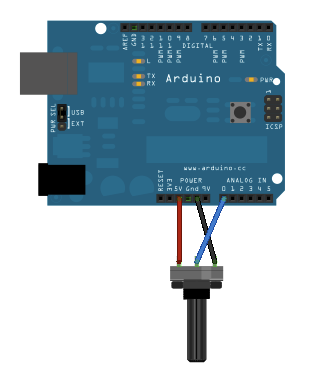

# 9 - Serial
This example shows you how to read analog input from the physical world using a potentiometer. In this example you will monitor the state of your potentiometer after establishing serial communication between your Arduino or Genuino and your computer running the Arduino Software (IDE).
## Parts Needed
- (1) Arduino Uno
- (1) USB A-to-B Cable
- (1) Potentiometer (10k Trimpot)
- (3) Jumper Wires

## Project Diagram


## Code
When running Arduino desktop version, Tools->Serial Monitor to access the monitor. Do not forget to select the same communication baud rate on the bottom of the monitor.

## Side note
In the sketch, the only thing that you do in the setup function is to begin serial communications, at 9600 bits of data per second, between your board and your computer with the command:
```c++
Serial.begin(9600);
```
Next, in the main loop of your code, you need to establish a variable to store the resistance value (which will be between 0 and 1023, perfect for an int datatype) coming in from your potentiometer:
```c++
int sensorValue = analogRead(A0);
```
Finally, you need to print this information to your serial monitor window. You can do this with the command Serial.println() in your last line of code:
```c++
Serial.println(sensorValue)
```
Now, when you open your Serial Monitor in the Arduino Software (IDE) (by clicking the icon that looks like a lens, on the right, in the green top bar or using the keyboard shortcut Ctrl+Shift+M), you should see a steady stream of numbers ranging from 0-1023, correlating to the position of the pot. As you turn your potentiometer, these numbers will respond almost instantly.

## More Readings
- [Serial](https://www.arduino.cc/reference/en/language/functions/communication/serial/)
- [Software Serial](https://www.arduino.cc/en/Tutorial/SoftwareSerialExample)
